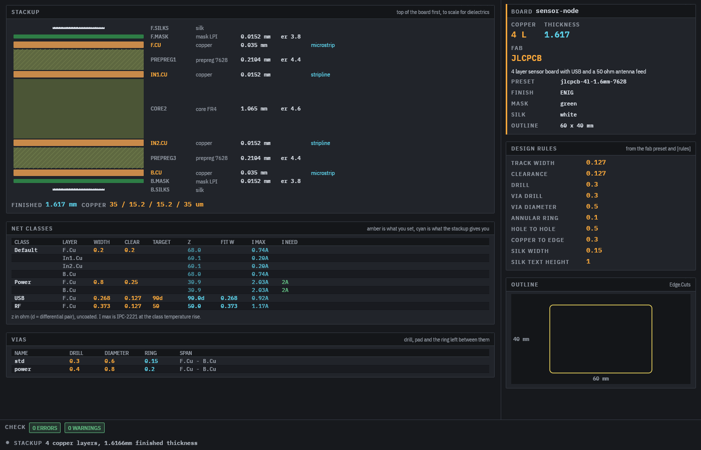
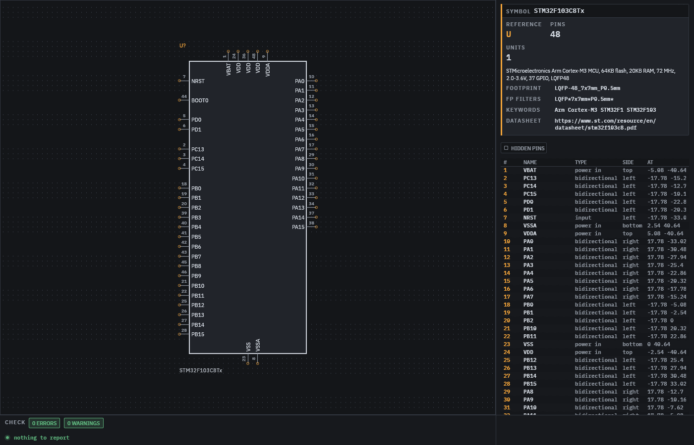
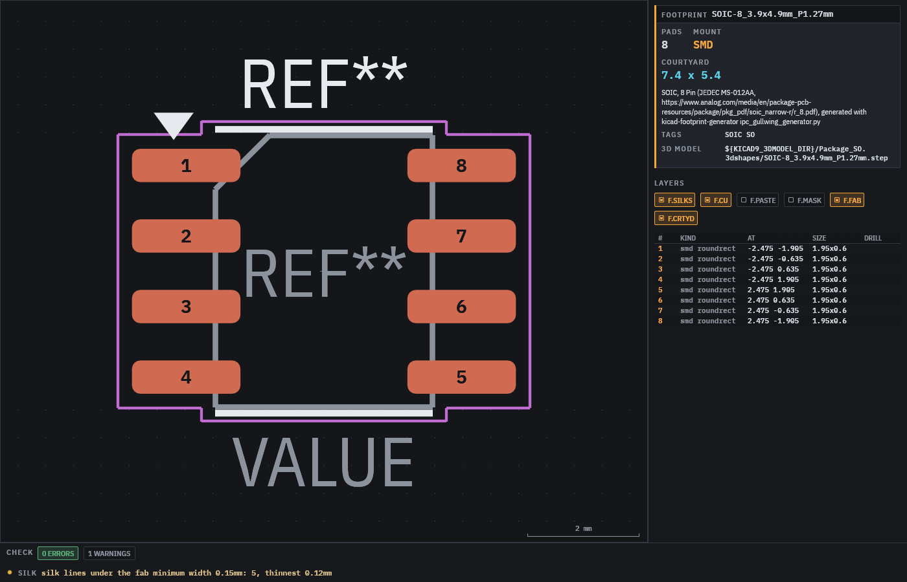

# agentee

Electronic design for agents. The design is plain TOML that an agent writes and edits; agentee
checks it, computes what the stackup gives you, and draws it. The window is a viewer for the
human watching, not an editor.

This first cut covers the board spec (stackup, fab rules, vias, net classes with impedance and
current targets) and the parts library (schematic symbols and footprints), with an importer for
the KiCad libraries so an agent rarely draws a part by hand.



## Files

| file | holds |
|---|---|
| `*.board.toml` | fab preset and rules, stackup, outline, vias, net classes |
| `*.sym.toml` | a schematic symbol, hand placed or generated from per-side pin lists |
| `*.fp.toml` | a footprint, with pad rows (`count` / `pitch`) instead of one entry per pad |

The full reference is [docs/format.md](docs/format.md), also printed by `agentee docs` and served
over MCP as `format_reference`. `examples/demo` is a small project that passes `check`.

## Use

```sh
cargo install --path crates/agentee

agentee new board sensor-node                  # starter files that pass check
agentee search symbol lm358                    # KiCad library names
agentee import symbol Amplifier_Operational:LM358 --footprint Package_SO:SOIC-8_3.9x4.9mm_P1.27mm
agentee check                                  # every item under .
agentee show sensor-node                       # resolved model and trace analysis as JSON
agentee render LM358 -o lm358.png              # PNG exactly as the viewer draws it
agentee calc impedance --layer F.Cu --target 50ohm
agentee calc trace-width --current 2A
agentee view                                   # live window, reloads on save
```

`check` exits 1 when there are errors, so it fits in a loop or CI.

## MCP

`agentee mcp <project>` serves the project on stdio. Tools: `format_reference`, `check`,
`list_items`, `show_item`, `render_item` (returns the PNG), `kicad_search`,
`import_kicad_symbol`, `import_kicad_footprint`, `new_item`, `trace_width`, `impedance`.

```json
{ "mcpServers": { "agentee": { "command": "agentee", "args": ["mcp", "/path/to/project"] } } }
```

## What check knows

- Stackup order, layer thicknesses, dielectric constants, finished thickness.
- Per net class and layer: microstrip or stripline geometry from the stackup, impedance
  (Hammerstad-Jensen, Wheeler, uncoated), the width that meets a target, IPC-2221 current.
- Vias and pads against the fab minimums: drill, annular ring, track, clearance, silk.
- Symbols: duplicate or overlapping pins, off-grid connection points, unit consistency.
- Footprints: overlapping pads, pads under the fab clearance, courtyard, silk over copper.
- Symbol to footprint: every pin number has a pad.

Fab presets are `generic` and `jlcpcb`; stackup presets are the JLCPCB 2 layer and JLC04161H
4 layer builds. The numbers come from the fab's published capabilities and move over time.

## Crates

| crate | |
|---|---|
| `agentee-core` | units, model, resolve and check, calculators |
| `agentee-kicad` | s-expression reader, `.kicad_sym` / `.kicad_mod` import |
| `agentee-view` | egui viewer on [egui_bench](https://github.com/v0l/egui_bench), headless PNG renderer |
| `agentee` | CLI and MCP server |

KiCad libraries are found under `/usr/share/kicad` or `KICAD9_SYMBOL_DIR` /
`KICAD9_FOOTPRINT_DIR`.



